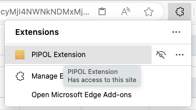

# PIPOL Extension

Adds a "PASTE PROVINCIAL INVESTMENTS" button to PIPOL System

> Note: This extension only works on Chrome-based browsers (Chrome, Brave, Edge, etc.).

## Installation

1. Download the latest release from https://github.com/mlab817/pipol_ext/releases, the **Source code (zip) file**. Unzip the downloaded file.
2. In your browser open the **extensions** in Settings.
   1. Open the extensions page by typing [browser_type]://extensions in the url address. For example, if you're using chrome, type _chrome://extensions_.
   2. Turn on Developer mode.

   
   3. Click Load Unpacked

 

   4. Select the extracted folder.

   5. To check if the extension is working, click on the extension button of your browser and check if the extension appeared. It should also show that the extension has access to the PIPOL site.

## Usage

To use the PIPOL extension:

1. From the PIPS PAP view screen, click on the "COPY" data in the provincial investments section.
2. In the PIPOL view my project screen, click on the "PASTE PROVINCIAL INVESTMENTS" button.

If there are no errors, the provincial investments will be pasted into the PIPOL System.

Some caveats:

1. The extension will only paste to selected provinces IN THE PIPOL System and will skip provinces that are not found. The extension will provide feedback to the user.
2. The extension will NOT detect if there are provinces in the PIPOL System that are not present in the PIPS System. Manual checking should be done.